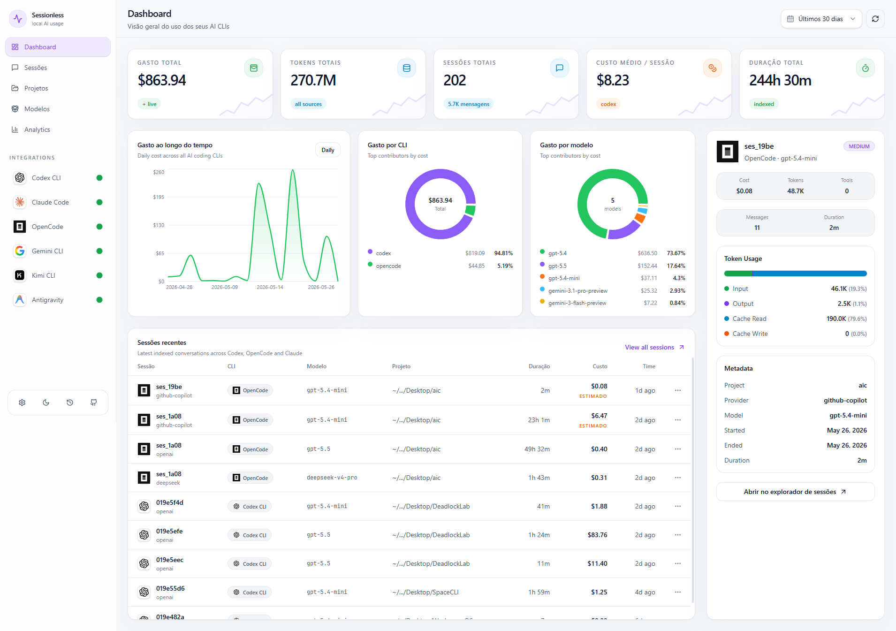

<div align="center">

# Sessionless

**Observabilidade local-first para AI Coding CLIs — multi-CLI, open-source, privado.**

[](LICENSE)
[](https://github.com/melloxyz/sessionless/releases)
[](https://nodejs.org)
[](https://pnpm.io)
[](https://www.typescriptlang.org)

*Rastreie custos, analise sessões e compare eficiência entre suas CLIs de IA — tudo offline, tudo local.*

[Funcionalidades](#funcionalidades) ·
[Quick Start](#quick-start) ·
[Stack](#stack-tecnológica) ·
[Arquitetura](#arquitetura) ·
[Integrações](#integrações-suportadas) ·
[Contribuindo](CONTRIBUTING.md)

<br/>



</div>

---

## Funcionalidades

| Recurso | Descrição |
|---|---|
| **Multi-CLI** | Suporte para 8 CLIs: Codex, Claude Code, OpenCode, Gemini CLI, Kimi, Aider, Qwen e Antigravity |
| **Rastreamento de custos** | Custo real da CLI, estimativa por tokens e sync com OpenRouter para pricing atualizado |
| **Sessões inteligentes** | Tokens (input/output/cache/reasoning), tool calls, duração, contexto do projeto |
| **Analytics** | Dashboard com trends de gastos, breakdown por modelo/provider/projeto, insights e anomalias |
| **Privacidade local-first** | SQLite via sql.js WASM — zero dados enviados externamente, zero telemetria |
| **Auto-ingestão** | Filesystem watcher observa diretórios das CLIs e atualiza automaticamente |
| **UI premium** | Design system OpenCode/Linear com temas claro/escuro e i18n EN/PT-BR |
| **Controles de projeto** | Oculte projetos sem deletar dados, abra pasta do projeto, timeline de commits git |

---

## Quick Start

### Pré-requisitos

- [Node.js](https://nodejs.org) >= 20
- [pnpm](https://pnpm.io) (`npm install -g pnpm`)

### Instalação

```bash
# Clone o repositório
git clone https://github.com/melloxyz/sessionless.git
cd sessionless

# Instale as dependências
pnpm install

# Execute em modo desenvolvimento
pnpm dev
```

Acesse o frontend em **http://localhost:5173** — o backend roda em **http://127.0.0.1:3030**.

### Comandos

| Comando | Descrição |
|---|---|
| `pnpm dev` | Stack completo (backend + frontend) |
| `pnpm typecheck` | Typecheck em todos os packages |
| `pnpm lint` | Lint em todos os packages |
| `pnpm build` | Build de produção |
| `pnpm --filter @sessionless/backend dev` | Apenas backend |
| `pnpm --filter @sessionless/frontend dev` | Apenas frontend |
| `pnpm --filter @sessionless/frontend build` | Build do frontend |

---

## Stack Tecnológica

| Camada | Tecnologia | Versão |
|---|---|---|
| **Runtime** | Node.js | >= 20 |
| **Gerenciador** | pnpm | >= 9 |
| **Linguagem** | TypeScript | 5.6 |
| **Backend** | Fastify | 5.x |
| **Database** | SQLite via sql.js | WASM |
| **Frontend** | React + Vite | 6.x |
| **Estilo** | Tailwind CSS | v4 |
| **Gráficos** | Recharts | 2.x |
| **Ícones** | Lucide React | latest |
| **Pricing** | OpenRouter API | sync |

---

## Arquitetura

```
sessionless/
├── packages/
│   ├── backend/          # Fastify + sql.js + OpenRouter sync + adapters
│   ├── frontend/         # React + Vite + Tailwind v4 + Recharts
│   └── shared/           # Tipos TypeScript compartilhados
├── scripts/              # Dev scripts (Windows-safe orchestration)
├── screenshots/          # Prints da interface para documentação
└── tsconfig.base.json    # Configuração TypeScript base
```

### Backend (`@sessionless/backend`)

- **Runtime:** Fastify em `127.0.0.1:3030`
- **Database:** SQLite via sql.js WASM (zero binários nativos)
- **Migrations:** Incrementais em `packages/backend/src/db/migrations/`
- **Custos:** Motor central com `actual`/`estimated`/`unknown` + fallback por tokens
- **Sync:** OpenRouter pricing em background no startup
- **Ingestão:** Auto-ingestão com filesystem watcher + debounce + scan periódico

### Frontend (`@sessionless/frontend`)

- **Dev server:** Vite em `5173` com proxy `/api` → backend
- **Estilo:** Tailwind v4 com CSS variables, shadcn-like primitives
- **Gráficos:** Recharts (AreaChart, LineChart, PieChart, BarChart)
- **Temas:** Light/dark persistente via localStorage
- **Idiomas:** English e Português (PT-BR) via `LanguageProvider`

### Shared (`@sessionless/shared`)

- Tipos TypeScript compartilhados: `Session`, `CliProvider`, `SourceConfidence`, etc.
- Usado por backend e frontend para manter contrato consistente

---

## Integrações Suportadas

| CLI | Status | Localização dos Dados | Confiança |
|---|---|---|---|
| **Codex CLI** | ✅ Suportado | `~/.codex/state_5.sqlite` + rollout JSONL | HIGH |
| **Claude Code** | ✅ Suportado | `~/.claude/projects/**/*.jsonl` | MEDIUM |
| **OpenCode** | ✅ Suportado | `~/.local/share/opencode/opencode.db` | HIGH |
| **Gemini CLI** | ✅ Suportado | `~/.gemini/tmp/**/chats/*.jsonl` | HIGH |
| **Kimi CLI** | ✅ Suportado | `~/.kimi/logs/kimi.log` | MEDIUM |
| **Aider** | ✅ Suportado | `.aider.chat.history.md` | LOW |
| **Qwen CLI** | ✅ Suportado | `~/.qwen/`, `~/.config/qwen/`, `~/.local/share/qwen/` | MEDIUM |
| **Antigravity** | ✅ Suportado | `~/.gemini/antigravity/` | MEDIUM |

> Cada adapter é isolado — uma mudança no schema de uma CLI não afeta as outras.

---

## Configuração

### Variáveis de Ambiente

Copie `.env.example` para `.env` e ajuste conforme necessário:

| Variável | Descrição | Padrão |
|---|---|---|
| `SESSIONLESS_PORT` | Porta do backend | `3030` |
| `DATABASE_PATH` | Caminho do arquivo SQLite | `./data/sessionless.db` |

### Auto-Ingestão

O Sessionless observa automaticamente os diretórios de dados das CLIs suportadas e atualiza os dados quando novos arquivos são escritos. Você pode desligar em **Settings > Auto-ingestion**.

---

## Roadmap

| Fase | Status | Descrição |
|---|---|---|
| Fase 0-2 | ✅ Concluído | Bootstrap, Foundation, Core Product |
| Fase 3 | ✅ Concluído | Multi-CLI (Codex, Claude, OpenCode) |
| Fase 3.5 | ✅ Concluído | UI/UX Premium (OpenCode/Linear style) |
| Fase 4 | ✅ Concluído | Advanced Analytics (insights, anomalias, multi-model) |
| Fase 5 | ✅ Concluído | CLI Expansion (Gemini, Kimi, Aider, Qwen, Antigravity) |
| Fase 6 | ✅ Concluído | UI Polish & Brand Assets |
| Fase 7 | ✅ Concluído | Runtime & Ingestion (auto-ingestão, filesystem watcher) |
| Fase 8 | 🚧 Em progresso | Controls & Alerts (budget limits, alertas locais) |
| Fase 9 | 📋 Planejado | Extensibility (plugin SDK, IDE integration) |
| Fase 10 | 📋 Planejado | Future / Cloud Optional (opt-in sync, team analytics) |

---

## Licença

Este projeto está sob a [MIT License](LICENSE).

---

<div align="center">

[Contribua](https://github.com/melloxyz/sessionless/issues) · [Reporte Bugs](https://github.com/melloxyz/sessionless/issues) · [Sugira Funcionalidades](https://github.com/melloxyz/sessionless/issues)

**Sessionless** — observabilidade local-first para AI Coding CLIs.

</div>
